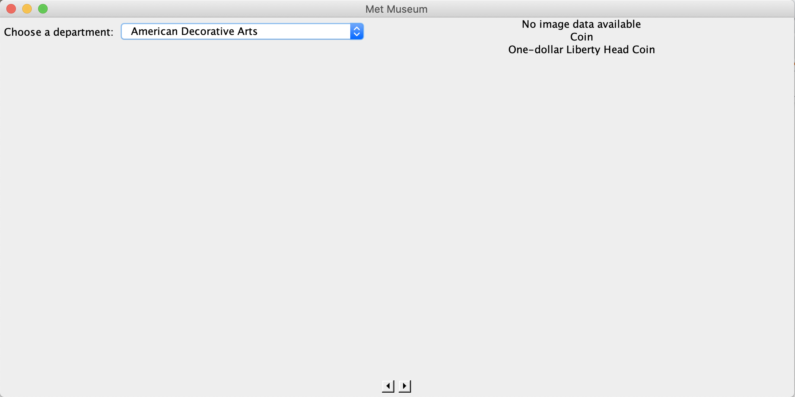
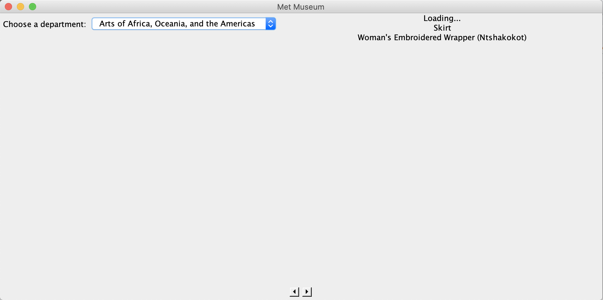
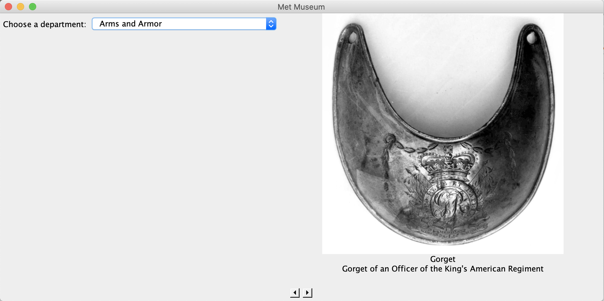

#MET MUSEUM API DISPLAY

This is an application I wrote for a final project in 
Computer Methodology. It gets the Departments in the 
Met Museum from [their API]("https://metmuseum.github.io/"). 
The user can choose what department 
they want. The objects from that department are then displayed. 
Each object is displayed with an image, a title, and a brief
description. The arrows can be used to go to the next or previous 
item.  
This application was used to assess skills in:
* APIs
* JSON
* Retrofit
* Gradle
* Mockito
* Model-View-Controller Pattern
* Factory pattern
* Executable jar file
* Markdown

When there is no image available, the application displays 
"No Image Data Available".
  

While the image is loading, the application displays "Loading..."
  

When there is an image to display, it is shown once fully 
loaded.
